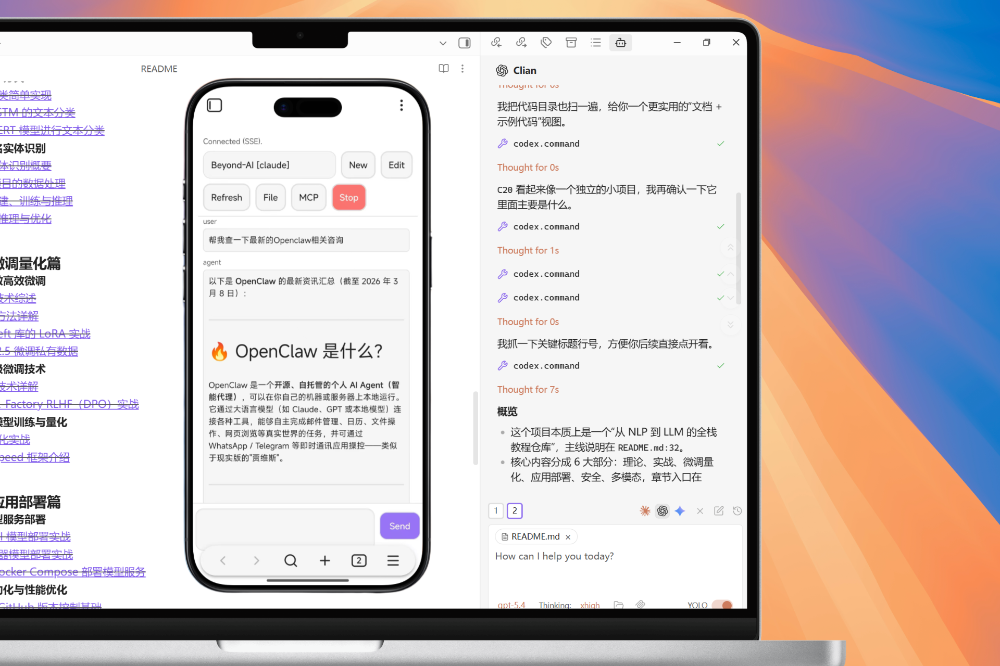

English | [中文](README_ZH.md)

# Clian

[](https://github.com/FutureUnreal/clian)
[](https://github.com/FutureUnreal/clian/releases/latest)
[](LICENSE)



An Obsidian plugin that embeds Claude / Codex / Gemini as AI collaborators in your vault. Your vault becomes the agent's working directory, giving it full agentic capabilities: file read/write, search, bash commands, and multi-step workflows.

This project is a derivative work based on [Claudian](https://github.com/YishenTu/claudian). Many thanks to [YishenTu](https://github.com/YishenTu) and the Claudian project for the original foundation and inspiration. On top of that foundation, this project additionally adds support for Codex, Gemini, and Android.

## Features

- **Full Agentic Capabilities**: Leverage Claude Code's power to read, write, and edit files, search, and execute bash commands, all within your Obsidian vault.
- **Multi-Engine Support**: Switch between Claude, Codex, and Gemini — each with its own tab, model selector, and engine-specific settings (thinking budget, reasoning effort, etc.).
- **Multi-Tab Interface**: Run multiple conversations in parallel tabs (3–10 configurable). Open per-engine tabs via command palette or toolbar.
- **Context-Aware**: Auto-attach the focused note, mention files with `@`, include editor or canvas selection, exclude notes by tag, and add external directories as context.
- **Vision Support**: Analyze images by sending them via drag-and-drop, paste, or file path.
- **Inline Edit**: Edit selected text or insert at cursor position directly in notes, with word-level diff preview.
- **Instruction Mode (`#`)**: Append custom instructions to the system prompt right from the chat input.
- **Slash Commands**: Reusable prompt templates triggered by `/command`, with argument placeholders, `@file` references, and optional bash substitutions.
- **Built-in Commands**: `/clear` (alias `/new`), `/add-dir [path]`, `/resume`, `/fork` — built into the slash command dropdown.
- **Bang-Bash Mode (`!`)**: Type `!` in an empty input to execute bash commands directly, bypassing the AI (must be enabled in settings).
- **Skills**: Extend Clian with reusable capability modules, compatible with Claude Code's skill format.
- **Custom Agents**: Define custom subagents with tool restrictions and model overrides; invoke via `@Agents/` mention.
- **Claude Code Plugins**: Auto-discover and enable plugins from `~/.claude/plugins`, with per-vault configuration.
- **MCP Support**: Connect external tools via Model Context Protocol servers (stdio, SSE, HTTP) with context-saving mode.
- **Plan Mode**: Toggle via Shift+Tab — Clian explores before implementing, then presents a plan for approval (Approve / Continue / Feedback / New Session).
- **Security**: Permission modes (YOLO/Safe/Plan), safety blocklist, and vault confinement with symlink-safe path checks.
- **i18n**: Plugin UI in 10 languages (English, 中文简体, 中文繁體, 日本語, 한국어, Deutsch, Français, Español, Русский, Português).
- **Claude in Chrome**: Allow Claude to interact with Chrome via the `claude-in-chrome` extension.

## Requirements

- [Claude Code CLI](https://code.claude.com/docs/en/overview) installed (native install recommended)
- Obsidian v1.8.9+ (minimum supported: v1.4.5)
- Claude subscription/API, or a custom provider supporting the Anthropic API format ([Openrouter](https://openrouter.ai/docs/guides/guides/claude-code-integration), [Kimi](https://platform.moonshot.ai/docs/guide/agent-support), [GLM](https://docs.z.ai/devpack/tool/claude), [DeepSeek](https://api-docs.deepseek.com/guides/anthropic_api), etc.)
- For **Codex**: `codex` CLI installed + `OPENAI_API_KEY`
- For **Gemini**: `gemini` CLI installed with its auth/credentials
- **Desktop (macOS, Linux, Windows)**: Full local integration (CLI + agentic tools).
- **Mobile (Android/iOS)**: Separate mobile plugin + hub server — see [Mobile & Hub](#mobile--hub) below.

## Installation

### From GitHub Release (recommended)

1. Download `main.js`, `manifest.json`, and `styles.css` from the [latest release](https://github.com/FutureUnreal/clian/releases/latest)
2. Create a folder called `clian` in your vault's plugins folder:
   ```
   /path/to/vault/.obsidian/plugins/clian/
   ```
3. Copy the downloaded files into that folder
4. Enable the plugin in Obsidian:
   - Settings → Community plugins → Enable "Clian"

### Using BRAT

[BRAT](https://github.com/TfTHacker/obsidian42-brat) (Beta Reviewers Auto-update Tester) allows you to install and automatically update plugins directly from GitHub.

1. Install the BRAT plugin from Obsidian Community Plugins
2. Enable BRAT in Settings → Community plugins
3. Open BRAT settings and click "Add Beta plugin"
4. Enter: `https://github.com/FutureUnreal/clian`
5. Click "Add Plugin" and BRAT will install Clian automatically
6. Enable Clian in Settings → Community plugins

> **Tip**: BRAT will automatically check for updates and notify you when a new version is available.

### For Developers

1. Clone this repository into your vault's plugins folder (requires Node.js 22):
   ```bash
   cd /path/to/vault/.obsidian/plugins
   git clone https://github.com/FutureUnreal/clian.git clian
   cd clian
   ```

2. Install dependencies and build:
   ```bash
   npm install
   npm run build
   ```

3. Enable the plugin in Obsidian:
   - Settings → Community plugins → Enable "Clian"

```bash
# Watch mode (auto-rebuild on save)
npm run dev

# Production build
npm run build
```

> **Tip**: Copy `.env.local.example` to `.env.local` and set your vault path to auto-copy files during development.

## Usage

**Two modes:**
1. Click the bot icon in ribbon, use the command palette, or press your configured hotkey to open chat
2. Select text (or place cursor) + hotkey for inline edit

Use it like Claude Code — read, write, edit, search files in your vault.

### Command Palette

All Clian commands are accessible via Obsidian's command palette (`Ctrl/Cmd+P`):

| Command | Description |
|---------|-------------|
| `Clian: Open chat view` | Open the chat sidebar |
| `Clian: Inline edit` | Edit selected text or insert at cursor in current note |
| `Clian: New tab` | Open a new Claude tab |
| `Clian: New Codex tab` | Open a new Codex tab |
| `Clian: New Gemini tab` | Open a new Gemini tab |
| `Clian: New session (in current tab)` | Start a fresh session in the active tab |
| `Clian: Close current tab` | Close the active tab |

### Context

- **File**: Auto-attaches focused note; type `@` to attach other files
- **@-mention dropdown**: Type `@` to see MCP servers, agents, external contexts, and vault files
  - `@Agents/` shows custom agents for selection
  - `@mcp-server` enables context-saving MCP servers
  - `@folder/` filters to files from that external context (e.g., `@workspace/`)
  - Vault files shown by default
- **Editor selection**: Select text in a Markdown note — selection auto-included as context
- **Canvas selection**: Select nodes in an Obsidian Canvas — selected node content auto-included
- **Files & images**: Drag-drop files into chat; images can also be pasted or typed by path; configure media folder for `![[image]]` embeds
- **External contexts**: Click folder icon in toolbar for access to directories outside vault; paths can be made persistent across sessions in Settings

### Built-in Slash Commands

Type `/` to see both user-defined commands and these built-in commands:

| Command | Description |
|---------|-------------|
| `/clear` (or `/new`) | Start a new conversation |
| `/add-dir [path]` | Add an external directory as context |
| `/resume` | Resume a previous conversation |
| `/fork` | Fork the entire conversation to a new session |

### Features

- **Inline Edit**: Select text + hotkey to edit; or place cursor + hotkey to insert at cursor. Word-level diff preview with accept/reject.
- **Instruction Mode**: Type `#` in the input to add instructions to the system prompt
- **Slash Commands**: Type `/` for custom prompt templates or skills (with argument placeholders)
- **Bang-Bash Mode**: Type `!` in an empty input box to run bash directly (bypasses AI). Must be enabled in Settings → Advanced → Enable Bang-Bash Mode. Output shown in the command panel.
- **Plan Mode**: Press Shift+Tab to toggle. Clian explores first, presents a plan, then you choose: Approve, Continue in current session, Provide feedback, or Approve in new session.
- **Fork Conversation**: Click the fork button on any user message, or use `/fork` to fork the whole conversation. Choose to open in current or new tab.
- **Skills**: Add `skill/SKILL.md` files to `~/.claude/skills/` or `{vault}/.claude/skills/`
- **Custom Agents**: Add `agent.md` files to `~/.claude/agents/` (global) or `{vault}/.claude/agents/` (vault-specific)
- **Claude Code Plugins**: Enable via Settings → Claude Code Plugins
- **MCP**: Add external tools via Settings → MCP Servers; use `@mcp-server` in chat to activate

### Keyboard Shortcuts

| Key | Action |
|-----|--------|
| Shift+Tab | Toggle Plan mode |
| `i` | Focus chat input (when messages area is focused) |
| `w` | Scroll messages up (when messages area is focused) |
| `s` | Scroll messages down (when messages area is focused) |
| Esc | Cancel streaming / exit Bang-Bash mode / close dropdowns |

> The `w`/`s`/`i` keys are the defaults and can be remapped in Settings → Vim-style navigation mappings (e.g., `map j scrollUp`, `map k scrollDown`).

## Configuration

### Settings

**Customization**
- **User name**: Your name for personalized greetings
- **Excluded tags**: Tags that prevent notes from auto-loading (e.g., `sensitive`, `private`)
- **Media folder**: Where vault stores attachments, for embedded image support (e.g., `attachments`)
- **Custom system prompt**: Additional instructions appended to the default system prompt
- **Enable auto-scroll**: Toggle automatic scrolling to bottom during streaming (default: on)
- **Auto-generate conversation titles**: AI-powered title generation after the first user message
- **Title generation model**: Model for auto-generating titles (default: Auto/Haiku)
- **Vim-style navigation mappings**: Remap scroll/focus keys (e.g., `map j scrollUp`, `map k scrollDown`, `map i focusInput`)
- **Language**: UI language; auto-detects from Obsidian locale or set manually

**Hotkeys**
- **Inline edit hotkey**: Hotkey to trigger inline edit on selected text (or cursor insert)
- **Open chat hotkey**: Hotkey to open the chat sidebar

**Slash Commands**
- Create/edit/import/export custom `/commands` (optionally override model and allowed tools)
- **Hidden commands**: List command names to hide from the slash command dropdown

**Skills / Custom Agents / Claude Code Plugins**
- View and manage discovered skills, agents, and plugins

**MCP Servers**
- Add/edit/verify/delete MCP server configurations with context-saving mode

**Safety**
- **Load user Claude settings**: Load `~/.claude/settings.json`
- **Enable command blocklist**: Block dangerous bash commands (default: on)
- **Blocked commands**: Patterns to block (supports regex, platform-specific)
- **Allowed export paths**: Paths outside the vault where files can be exported (default: `~/Desktop`, `~/Downloads`)

**Environment**
- **Custom variables**: Environment variables for Claude SDK (KEY=VALUE format, supports `export ` prefix)
- **Environment snippets**: Save and restore environment variable configurations

**Advanced**
- **Enable 1M context window**: Show Sonnet with 1M context in model selector (requires Max subscription)
- **Extra Claude model IDs**: Add specific Claude model version IDs to the model picker
- **Enable Bang-Bash Mode**: Allow `!` prefix to run bash directly (disabled by default; requires Node.js in PATH)
- **Enable Chrome support**: Enable `claude-in-chrome` extension support (disabled by default)
- **Max tabs**: Maximum number of chat tabs (3–10, default: 3)
- **Tab bar position**: Show tab bar above the input area (`input`) or in the header (`header`)
- **Open chat in main editor area**: Open the chat panel as a main editor tab instead of the sidebar
- **Claude CLI path**: Per-device path to Claude Code CLI (auto-detected if empty)
- **Codex CLI command**: Per-device command for Codex CLI (default: `codex`)
- **Gemini CLI command**: Per-device command for Gemini CLI (default: `gemini`)

### Claude Settings

- **Model**: Select from Haiku, Sonnet, Opus, and any custom models defined via environment variables or extra model IDs
- **Thinking budget**: Off / Low / Medium / High / Maximum (extended thinking tokens)

### Codex Settings

- **Model**: Default, or select from gpt-5-codex, gpt-5.1-codex, gpt-5.2-codex, etc.
- **Reasoning effort**: Low / Med / High / xhigh

### Gemini Settings

- **Model**: Default, or select from gemini-2.5-pro, gemini-2.5-flash, gemini-3-pro-preview, etc.
- **Thinking mode**: Auto / Off / Lite (512 tokens) / Default (8k) / High (16k) / Unlimited

## Safety and Permissions

| Scope | Access |
|-------|--------|
| **Vault** | Full read/write (symlink-safe via `realpath`) |
| **Export paths** | Write-only (e.g., `~/Desktop`, `~/Downloads`) |
| **External contexts** | Full read/write (session-only, or persistent via settings) |

- **YOLO mode**: No approval prompts; all tool calls execute automatically (default)
- **Safe mode**: Approval prompt per tool call; Bash requires exact match, file tools allow prefix match
- **Plan mode**: Explores and designs a plan before implementing. Toggle via Shift+Tab in the chat input

## Mobile & Hub

Mobile support uses a **separate mobile plugin** (`src/mobile/`) paired with a **hub server** running on your desktop or server. The mobile plugin connects to the hub via HTTP + SSE (Server-Sent Events) for real-time streaming.

### Hub Server Setup

The hub supports all three engines: `claude`, `codex`, `gemini`.

**Quick start** (from the plugin folder):

Option A — config file:
```bash
cp hub/config.example.json .clian-hub/config.json
# Edit token and cwd in the config file
npm run hub
```

Option B — environment variables:

```bash
# macOS / Linux
export CLIAN_HUB_TOKEN=your-secret-token
export CLIAN_HUB_CWD=/path/to/your/vault
export CLIAN_HUB_PORT=3006
npm run hub

# Windows (PowerShell)
$env:CLIAN_HUB_TOKEN="your-secret-token"
$env:CLIAN_HUB_CWD="C:\path\to\vault"
npm run hub
```

> If no token is set and no config file exists, the hub **auto-generates a token** on first run and prints it to the console.

**In Obsidian mobile:**
- Settings → Clian → Hub URL: `http://<your-lan-ip>:3006`
- Settings → Clian → Hub access token: `your-secret-token`

### Hub Configuration Reference

**Required:**
| Variable | Config key | Description |
|----------|------------|-------------|
| `CLIAN_HUB_TOKEN` | `token` | Shared secret (Hub access token) |

**Common:**
| Variable | Config key | Default | Description |
|----------|------------|---------|-------------|
| `CLIAN_HUB_CWD` | `cwd` | process cwd | Default working directory for sessions |
| `CLIAN_HUB_HOST` | `host` | `0.0.0.0` | Listen address |
| `CLIAN_HUB_PORT` | `port` | `3006` | Listen port |
| `CLIAN_HUB_DATA_DIR` | — | `.clian-hub/` | Stores `config.json` and `state.json` |
| `CLIAN_HUB_DEBUG` | `debug` | `false` | Enable debug logging |

**Uploads:**
| Variable | Config key | Default | Description |
|----------|------------|---------|-------------|
| `CLIAN_HUB_MAX_UPLOAD_BYTES` | — | `20971520` (20 MB) | Max file upload size; stored in `.clian/hub_uploads/` |

**Claude-specific:**
| Variable | Config key | Description |
|----------|------------|-------------|
| `CLIAN_HUB_CLAUDE_CODE_PATH` | `claudeCodePath` | Path to Claude Code CLI |
| `CLIAN_HUB_MODEL` | `model` | Default Claude model |
| `CLIAN_HUB_CLAUDE_SETTING_SOURCES` | `claudeSettingSources` | `user,project` — set to `project` to skip `~/.claude/settings.json` |

**Codex-specific:**
| Variable | Config key | Default | Description |
|----------|------------|---------|-------------|
| `CLIAN_HUB_CODEX_COMMAND` | `codexCommand` | `codex` | Codex CLI command |
| `CLIAN_HUB_CODEX_SANDBOX` | `codexSandbox` | — | Sandbox mode (`read-only`, `workspace-write`) |

**Gemini-specific:**
| Variable | Config key | Default | Description |
|----------|------------|---------|-------------|
| `CLIAN_HUB_GEMINI_COMMAND` | `geminiCommand` | `gemini` | Gemini CLI command |
| `CLIAN_HUB_GEMINI_APPROVAL_MODE` | `geminiApprovalMode` | `yolo` | Approval mode |
| `CLIAN_HUB_GEMINI_SANDBOX` | `geminiSandbox` | `false` | Enable `--sandbox` |

> **Note**: Tool approvals (approve/deny per tool call) are only available for `claude` sessions. For `codex` and `gemini`, use their sandbox settings to control permissions.

> **Requirements**: Node.js 18+. The full project dev environment requires Node.js 22.

See [`hub/README.md`](hub/README.md) for full documentation.

## Privacy & Data Use

- **Sent to API**: Your input, attached files, images, and tool call outputs. Default: Anthropic; custom endpoint via `ANTHROPIC_BASE_URL`.
- **Local storage**: Settings, session metadata, and commands stored in `vault/.claude/`; session messages in `~/.claude/projects/` (SDK-native); legacy sessions in `vault/.claude/sessions/`.
- **No telemetry**: No tracking beyond your configured API provider.

## Troubleshooting

### Claude CLI not found

If you encounter `spawn claude ENOENT` or `Claude CLI not found`, the plugin can't auto-detect your Claude installation. Common with Node version managers (nvm, fnm, volta).

**Solution**: Find your CLI path and set it in Settings → Advanced → Claude CLI path.

| Platform | Command | Example Path |
|----------|---------|--------------|
| macOS/Linux | `which claude` | `/Users/you/.volta/bin/claude` |
| Windows (native) | `where.exe claude` | `C:\Users\you\AppData\Local\Claude\claude.exe` |
| Windows (npm) | `npm root -g` | `{root}\@anthropic-ai\claude-code\cli.js` |

> **Note**: On Windows, avoid `.cmd` wrappers. Use `claude.exe` or `cli.js`.

**Alternative**: Add your Node.js bin directory to PATH in Settings → Environment → Custom variables.

### npm CLI and Node.js not in same directory

If using npm-installed CLI, check if `claude` and `node` are in the same directory:
```bash
dirname $(which claude)
dirname $(which node)
```

If different, GUI apps like Obsidian may not find Node.js.

**Solutions**:
1. Install native binary (recommended)
2. Add Node.js path to Settings → Environment: `PATH=/path/to/node/bin`

**Still having issues?** [Open a GitHub issue](https://github.com/FutureUnreal/clian/issues) with your platform, CLI path, and error message.

## Architecture

```
src/
├── main.ts                      # Plugin entry point
├── core/                        # Core infrastructure
│   ├── agent/                   # Claude Agent SDK wrapper
│   ├── agents/                  # Custom agent management (AgentManager)
│   ├── commands/                # Slash command management (SlashCommandManager)
│   ├── hooks/                   # PreToolUse/PostToolUse hooks
│   ├── images/                  # Image caching and loading
│   ├── mcp/                     # MCP server config, service, and testing
│   ├── plugins/                 # Claude Code plugin discovery and management
│   ├── prompts/                 # System prompts for agents
│   ├── sdk/                     # SDK message transformation
│   ├── security/                # Approval, blocklist, path validation
│   ├── storage/                 # Distributed storage system
│   ├── tools/                   # Tool constants and utilities
│   └── types/                   # Type definitions
├── features/                    # Feature modules
│   ├── chat/                    # Main chat view + UI, rendering, controllers, tabs
│   ├── inline-edit/             # Inline edit service + UI
│   └── settings/                # Settings tab UI
├── mobile/                      # Mobile plugin (separate plugin entry point)
├── shared/                      # Shared UI components and modals
│   ├── components/              # Input toolbar bits, dropdowns, selection highlight
│   ├── mention/                 # @-mention dropdown controller
│   ├── modals/                  # Instruction modal
│   └── icons.ts                 # Shared SVG icons
├── i18n/                        # Internationalization (10 locales)
├── utils/                       # Modular utility functions
└── style/                       # Modular CSS (→ styles.css)
hub/                             # Remote hub server (for mobile)
├── server.mjs                   # Hub server (Node.js 18+)
├── config.example.json          # Hub config template
└── README.md                    # Hub documentation
```

## Roadmap

- [x] Claude Code Plugin support
- [x] Custom agent (subagent) support
- [x] Claude in Chrome support
- [x] `/compact` command
- [x] Plan mode
- [x] `rewind` and `fork` support (including `/fork` command)
- [x] `!command` support
- [x] Codex and Gemini engine support
- [x] Multi-tab interface
- [x] Mobile plugin + hub server
- [ ] Tool renderers refinement
- [ ] Hooks and other advanced features
- [ ] More to come!

## Star History

[](https://www.star-history.com/#FutureUnreal/clian&Date)

## License

Licensed under the [MIT License](LICENSE).

## Acknowledgments

- [Claudian](https://github.com/YishenTu/claudian) by [YishenTu](https://github.com/YishenTu) for the original foundation this project builds on
- [Obsidian](https://obsidian.md) for the plugin API
- [Anthropic](https://anthropic.com) for Claude and the [Claude Agent SDK](https://platform.claude.com/docs/en/agent-sdk/overview)
